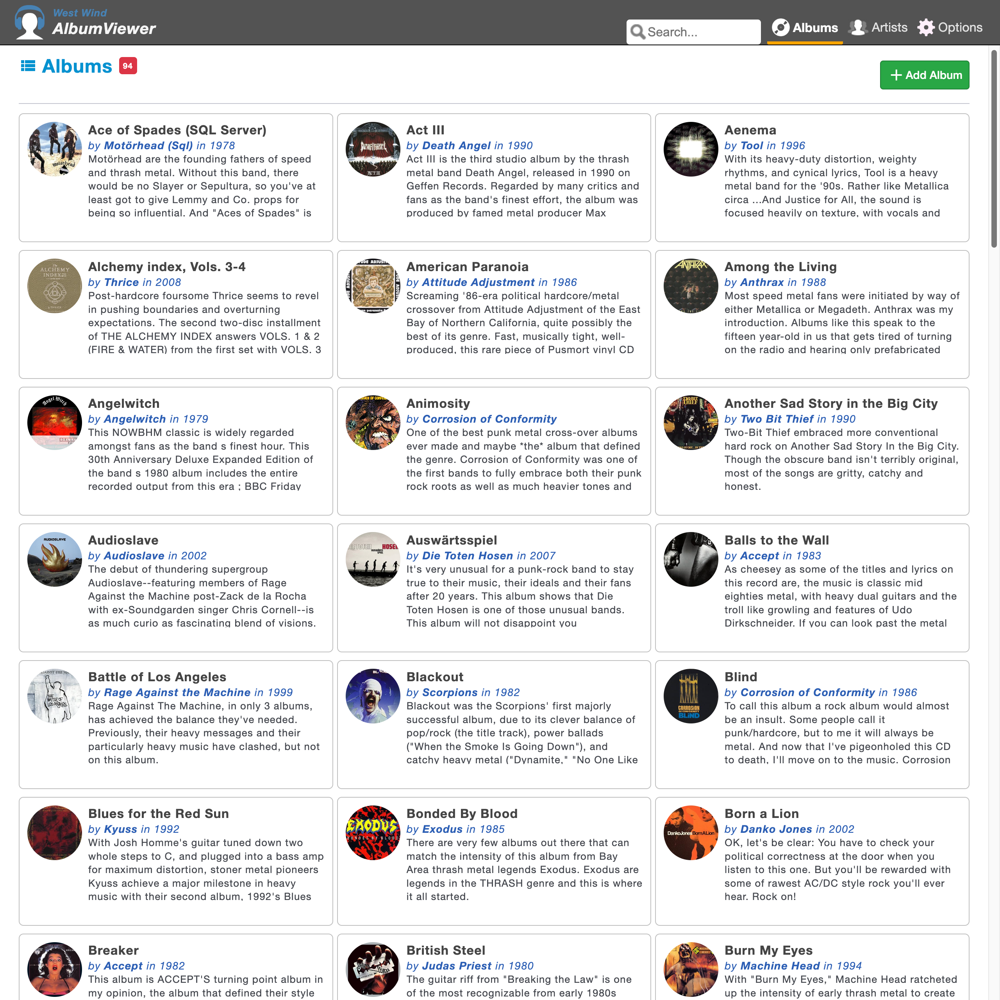
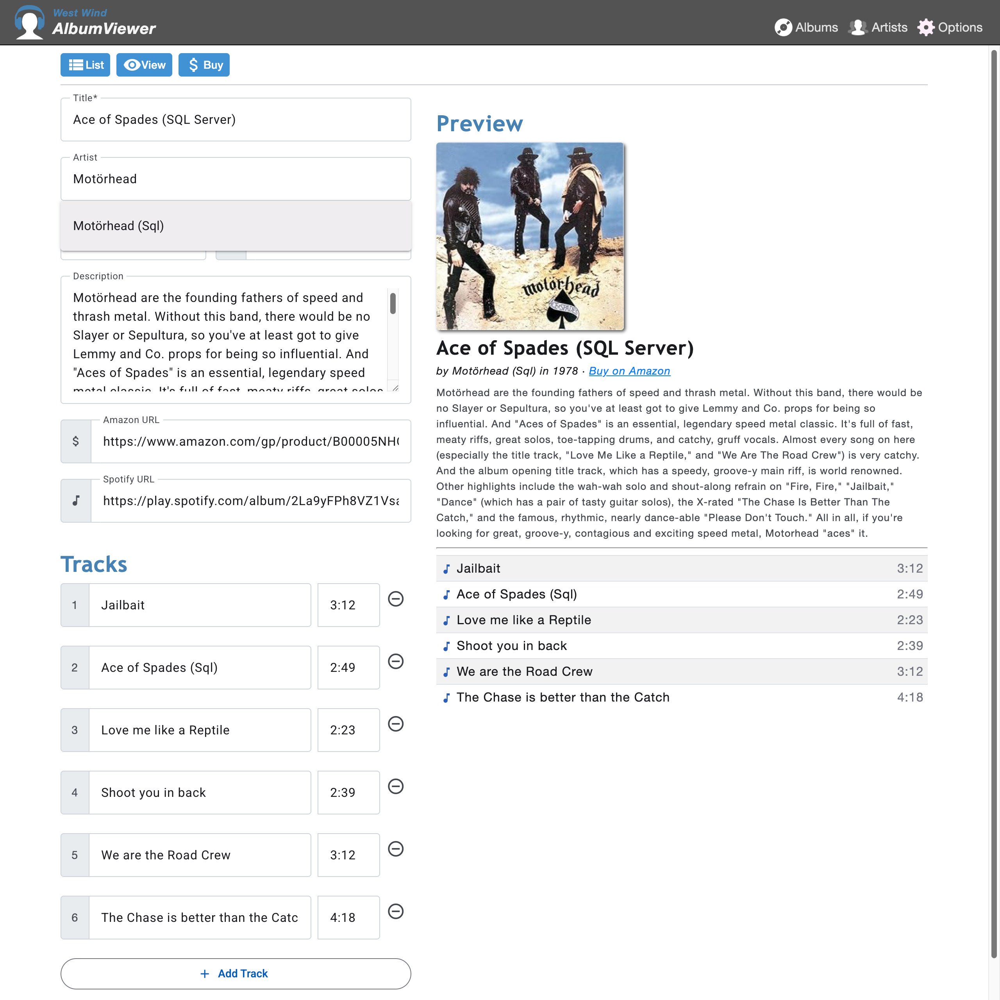
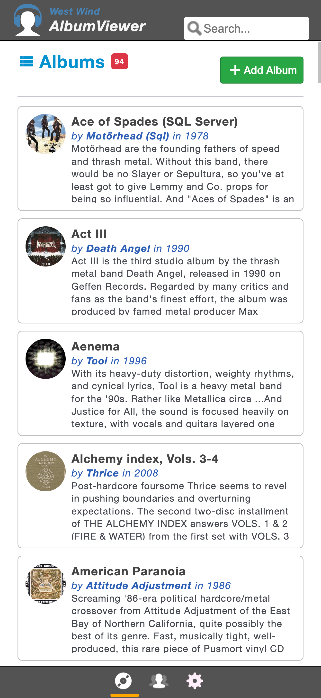
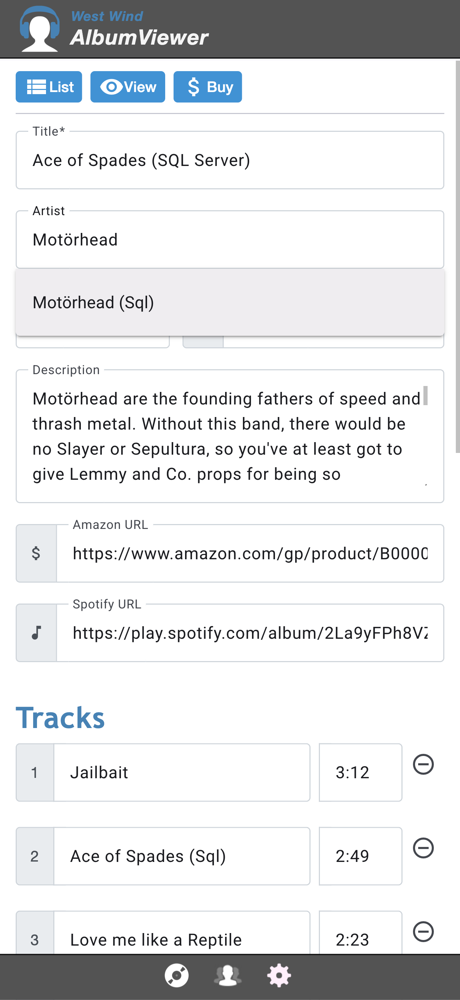

# AlbumViewer — music-db fork

**Sample Angular application demonstrating ASP.NET Core API features, upgraded to .NET 10 and Angular 22.**

Forked from [RickStrahl/AlbumViewerVNext](https://github.com/RickStrahl/AlbumViewerVNext). This is a working development baseline for the music-db web application migration, upgraded from its original .NET 8 / Angular 11 / SQLite-only state to .NET 10 / Angular 22 + Material, with SQLite, SQL Server, and PostgreSQL all supported as interchangeable data providers. The frontend is at full functional and visual parity with the original Angular 11 app.

**Live sample (original):** [albumviewer.west-wind.com](https://albumviewer.west-wind.com)

**On the Desktop:**




**In a Mobile Web Browser:**




---

## Security and privacy

This repository is **public** (GitHub does not allow forked repositories to be made private).

Rules that must be observed at all times:

- **No personal data** — no real album, artist, or media item data from the music-db collection; only the AlbumViewer seed data (`albums.js`) belongs here
- **No credentials** — no passwords, connection strings with passwords, API keys, or tokens committed to any file; use `dotnet user-secrets` for local dev secrets
- **No private config** — no `appsettings.*.json` overrides containing real hostnames, usernames, or environment-specific values
- **No database exports** — no SQL dumps, CSV exports, or any data derived from the live `musicdb` PostgreSQL database

All actual music-db data, schema exports, and personal content live elsewhere.

---

## ASP.NET Core features

The backend demonstrates:

- Creating an API backend service with business logic isolated from controller code
- A repository layer built on [`Westwind.Data.EfCore`](https://github.com/RickStrahl/Westwind.Data) (replaces the original's bundled `EntityFrameworkRepository`)
- **Three interchangeable EF Core data providers** — SQLite (zero-config default), SQL Server, and PostgreSQL — switched with a single `Data:Provider` setting, no code changes
- Custom JWT bearer token authentication, plus cookie auth for Swagger/API-explorer access
- CORS support
- Structured JSON error responses via `IExceptionHandler` (`ApiException` → typed error payload)
- Serilog structured logging (console + rolling file)
- A single self-contained deployable app — `MapStaticAssets` + `MapFallbackToFile` serve the Angular build directly; no separate reverse proxy needed
- 27 xUnit integration tests, verified against both SQLite and PostgreSQL

Version supported:
- **.NET 10.0**
- **10.0.1xx SDK** (not the Visual-Studio-bundled `10.0.3xx`)

## Angular features

The frontend demonstrates:

- **Angular 22** standalone components, **zoneless** change detection (no `zone.js`) — state changes flow through signals
- **Angular Material** (Azure/Blue theme) as the component library, replacing the original's Bootstrap 4
- A CSS custom-property "skin" layer (`themes/strahl.scss`) that reproduces the original's exact visual design over plain Angular Material — remove one `@use` line and the app degrades cleanly to an unstyled Material baseline
- Client-side and server-side validation
- JWT auth guard + interceptor
- Route transitions via the browser-native **View Transitions API** — no `@angular/animations` DSL needed
- Vitest unit tests (component + service specs)
- `ng serve` dev proxy to the API, with LiveReload

Version supported:
- **Angular 22.1**
- **Angular CLI 22.1**
- **Node.js 22 LTS**

## Improvements over the original

A few things fixed or added during the port that weren't present (or were broken) in the original Angular 11 app:

- **Delete from list** is actually wired up — the original's `deleteAlbum()`/`deleteArtist()` list-item handlers were empty stub methods
- **Error display** on every view, not just some
- **Toast notifications** via `MatSnackBar` for save/delete/error feedback, replacing `toastr`
- **Scroll position restoration** when navigating back to a list
- **Mobile bottom nav bar** — a real feature of the original (`appFooter.html`) that reclaims header space at narrow widths, faithfully reproduced (and a regression in an earlier pass of this port, where the nav vanished entirely below 640px, since fixed)

---

[`docs/api-reference.md`](docs/api-reference.md) documents every endpoint, its response shape, validation rules, and behavioral dependencies (cascade delete, artist auto-create, 204 vs 404 on unknown id, etc.).

[`src/AlbumViewer.Tests`](src/AlbumViewer.Tests) contains integration tests that assert all documented behaviors, including all interdependencies.

**Rule:** any change to API behavior — response shape, validation rule, cascade logic, error code — must be reflected in both `docs/api-reference.md` and the corresponding test. If behavior and documentation disagree, the tests are the ground truth.

---

## Getting started

### Prerequisites

- .NET 10 SDK (`10.0.1xx` build)
- Node.js 22 LTS, Angular CLI 22
- SQL Server or PostgreSQL only if you want to use those providers instead of the zero-config SQLite default

### Backend — SQLite (default, zero-config)

No setup needed. `appsettings.json` already has `Data:Provider` set to `sqlite`.

```powershell
cd src/AlbumViewerNetCore
dotnet run
```

Navigate to `http://localhost:5000`. On first run the schema is created and seeded from `albums.js` automatically, in a `AlbumViewerData.sqlite` file inside the project's content root.

### Backend — SQL Server

Create an empty database, then point `Data:SqlServerConnectionString` at it (via `appsettings.Development.json` or `dotnet user-secrets` — never commit a real connection string) and set `Data:Provider` to `sqlserver`:

```powershell
cd src/AlbumViewerNetCore
dotnet user-secrets set "Data:Provider" "sqlserver"
dotnet user-secrets set "Data:SqlServerConnectionString" "server=.;database=AlbumViewer;integrated security=true;Encrypt=False;MultipleActiveResultSets=true;App=AlbumViewer"
dotnet run
```

### Backend — PostgreSQL (bonus)

Run [`db/create_database.sql`](db/create_database.sql) against your PostgreSQL instance (connected to the `postgres` maintenance database) to create the `albumviewer` database, then set `Data:Provider` and the connection string:

```powershell
cd src/AlbumViewerNetCore
dotnet user-secrets set "Data:Provider" "postgresql"
dotnet user-secrets set "ConnectionStrings:AlbumViewer" "Host=localhost;Database=albumviewer;Username=postgres;Password=yourpassword"
dotnet run
```

### Frontend

```powershell
cd src/AlbumViewerAngular
npm install
ng serve          # dev server at localhost:4200 with /api proxy to localhost:5000
ng build          # production build to src/AlbumViewerNetCore/wwwroot
```

**Dev workflow:** run both `dotnet run` (backend) and `ng serve` (frontend) simultaneously. Use `localhost:4200` during development for hot reload. Use `localhost:5000` after `ng build` to verify the production output the .NET app actually serves.

> `wwwroot/` is a build artifact and is excluded from git. Run `ng build` before `dotnet run` on a fresh checkout — the backend has nothing to serve at `/` without it.

**Default login:** `test` / `test`

### Run in Docker

Single self-contained container — SQLite zero-config, no external database dependency:

```powershell
docker compose build
docker compose up
```

Navigate to `http://localhost:5000`.

---

## Project structure

```
src/
  AlbumViewerNetCore/     — ASP.NET Core 10 API host (also serves the built Angular app)
  AlbumViewerBusiness/    — EF Core entities, repositories, DbContext
  AlbumViewerAngular/     — Angular 22 + Material frontend (build output → AlbumViewerNetCore/wwwroot)
  AlbumViewer.Tests/      — xUnit integration tests (27 tests; SQLite or PostgreSQL via ALBUMVIEWER_TEST_CONNSTR)
db/
  create_database.sql     — PostgreSQL database creation script
```

---

## Provenance

Original: [RickStrahl/AlbumViewerVNext](https://github.com/RickStrahl/AlbumViewerVNext) — MIT licence.

This fork is part of the music-db migration project and is not intended as a general-purpose sample.
